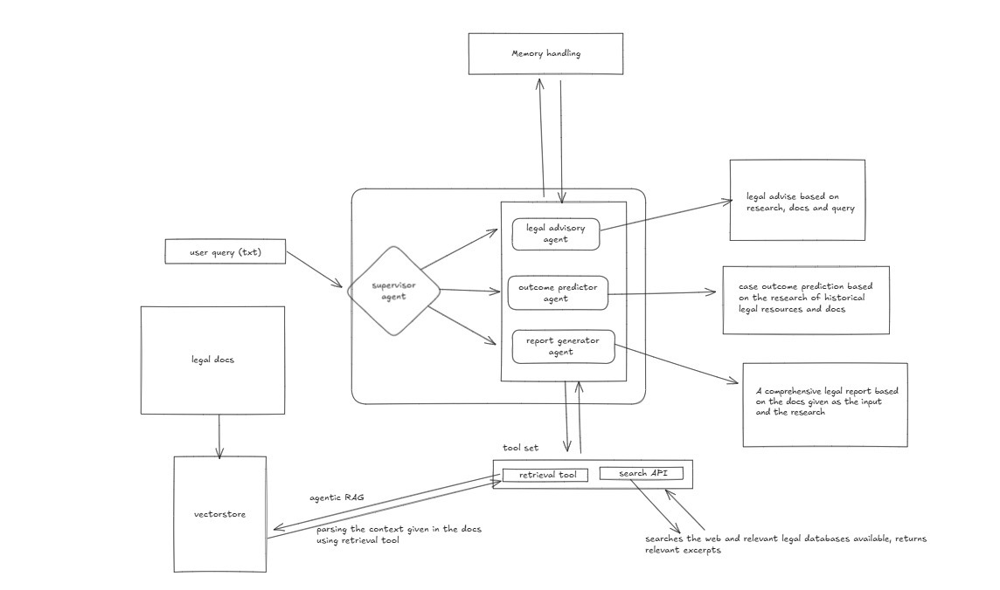

# NaviLaw

## Overview
The **NaviLaw** system integrates the **ReAct** (Reasoning and Action Agentic Architecture) with **RAG** (Retrieval Augmented Generation), powered by the Llama3 70B language model, to manage tasks such as legal advisory, report generation, and case outcome prediction. This setup allows the system to act as an intelligent agent, conducting in-depth research on relevant legal databases and retrieving critical documents from user-uploaded files. Through sophisticated reasoning and document processing, it delivers actionable insights. Utilizing prebuilt tools and models, NaviLaw processes user queries, retrieves relevant legal excerpts, and dynamically generates responses, reports, or predictions, while ensuring real-time interactivity.



## Features
- **Legal Query Processing:** Users can submit queries related to legal issues, and the system generates relevant insights based on the context of uploaded legal documents.
- **Document Upload:** Supports uploading multiple PDF documents for analysis and retrieval.
- **Legal Precedent Retrieval:** Automatically retrieves and summarizes relevant legal precedents based on the query.
- **Dynamic Report Generation:** Generates concise legal reports, including key findings, analysis, and recommendations.
- **AI-Powered Search:** Utilizes the Tavily Search tool for supplementary legal research when needed.

## Requirements
- Python 3.7 or higher
- FastAPI
- LangChain
- PyPDF2
- Tavily Search Tool
- Streamlit
- Other dependencies listed in `requirements.txt` (in the backend directory)

## Installation
1. Clone the repository:
   ```bash
   git clone https://github.com/devroopsaha744/navilaw-ai
   cd navilaw-ai
   ```
2. Set up a virtual environment:
   ```bash
   python -m venv venv
   source venv/bin/activate  # On Windows use `venv\Scripts\activate`
   ```
3. Install the required packages:
   ```bash
   pip install -r requirements.txt
   ```
4. Set up environment variables:
   Create a `.env` file in the root directory and add your API keys:
   ```
   GROQ_API_KEY=your_api_key_here
   TAVILY_API_KEY=your_api_key_here
   HF_TOKEN=your_hf_token
   ```

## API Base URL
The base URL for the API is:
```
https://huggingface.co/spaces/datafreak/navilaw-ai
```

## API Endpoints

- **Root Endpoint:** `GET /`
  - **Response:**
    ```json
    {"message": "Welcome to the Legal Research API! Please use one of the endpoints for requests."}
    ```

- **Legal Assistance:** `POST /legal-assistance/`
  - **Parameters:**
    - `query` (string): The legal question or issue.
    - `option` (string): The type of legal assistance requested (e.g., "Legal Advisory", "Legal Report Generation", "Case Outcome Prediction").
    - `files` (multiple PDF files): Legal documents relevant to the query.
  - **Response:** Returns a JSON object with the results based on the chosen option.

- **Legal Advisory:** `POST /legal-advisory/`
  - **Parameters:**
    - `query` (string): The legal question or issue.
    - `files` (multiple PDF files): Legal documents relevant to the query.
  - **Response:** Returns a JSON object with the AI-powered legal advice.
  
- **Case Outcome Prediction:** `POST /case-outcome-prediction/`
  - **Parameters:**
    - `query` (string): The legal question or issue.
    - `files` (multiple PDF files): Legal documents relevant to the case details.
  - **Response:** Returns a JSON object with the predicted case outcome.

- **Legal Report Generation:** `POST /report-generator/`
  - **Parameters:**
    - `query` (string): The legal question or issue.
    - `files` (multiple PDF files): Legal documents relevant to the query.
  - **Response:** Returns a JSON object with the generated legal report.

## Example Requests

### Legal Assistance Example Request (`POST /legal-assistance/`)
```json
{
  "query": "What are the legal implications of XYZ Corp terminating the contract with ABC Ltd. due to non-payment? Can ABC Ltd. challenge the termination?",
  "option": "Legal Advisory",
  "files": ["contract.pdf", "case_law.pdf"]
}
```

### Legal Advisory Example Request (`POST /legal-advisory/`)
```json
{
  "query": "Based on the breach notice and contract terms, what legal actions can be taken if the supplier fails to deliver the goods?",
  "files": ["contract.pdf", "breach_notice.pdf"]
}
```

### Case Outcome Prediction Example Request (`POST /case-outcome-prediction/`)
```json
{
  "query": "What is the likelihood of winning a contract dispute given these case details?",
  "files": ["dispute_case.pdf"]
}
```

### Legal Report Generation Example Request (`POST /report-generator/`)
```json
{
  "query": "Generate a report on intellectual property rights for software companies.",
  "files": ["IP_laws.pdf", "company_policy.pdf"]
}
```

## Running with Docker
The API can also be set up using Docker. The `Dockerfile` is located inside the `backend` directory.

### Build the Docker Image
```bash
docker build -t navilaw-api ./backend
```

### Run the Docker Container
```bash
docker run -p 10000:10000 navilaw-api
```

## Flutter App
You can also access the **NaviLaw** web application using Flutter:
[Navilaw-ai](https://navilaw-ai.streamlit.app/)

## Demo Video
[Watch the video here](https://youtu.be/NzFPQV9l6pY?si=R9D_Zmb7tMv0fJ49)

## Screenshots

  
  
  
  
  
  
  


## Directory Structure
```
└── devroopsaha744-navilaw-ai/
    ├── README.md
    ├── LICENSE
    ├── graphlogic.ipynb
    ├── backend/
    │   ├── main.py
    │   ├── requirements.txt
    |   ├── Dockerfile
    |   ├── .dockerignore
    │   ├── retrieval.py
    │   ├── templates.py
    │   ├── test.py
    │   └── tools.py
    ├── frontend/
    │   ├── app.py
    │   └── requirements.txt
    ├── images/
    └── sample/
```

## Disclaimer
This application is AI-generated and may not account for all real-world legal factors. It is not intended as a substitute for professional legal advice.

## License
This project is licensed under the MIT License. See the LICENSE file for details.

## Acknowledgments
- FastAPI for building the API
- LangChain for Agentic RAG capabilities
- PyPDF2 for PDF processing
- Tavily for supplementary legal research
- Streamlit for the User Interface
